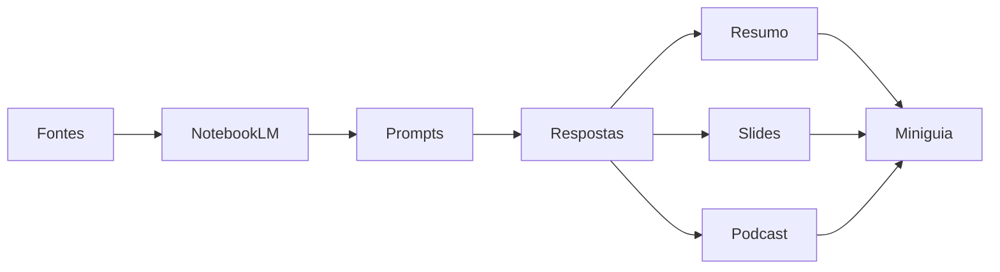

<div align="center">

# 💰 NotebookLM • Educação Financeira

### 📚 Inteligência Artificial aplicada ao aprendizado de Educação Financeira


---

*"Transformando documentos em conhecimento através da IA."*

</div>

---

# 🧭 Navegação

- 🎯 Objetivos
- 📚 Fontes
- 🧠 Engenharia de Prompts
- ⚠️ Troubleshooting
- 🎧 Recursos do NotebookLM
- 📖 Miniguia
- 💬 Prompts reutilizáveis
- 📊 Resultados
- 👨‍💻 Autor

---

# 🎯 Missão do Projeto

> **Problema**

Como utilizar IA para aprender Educação Financeira de forma organizada?

> **Solução**

Utilizar o NotebookLM para analisar documentos, gerar respostas contextualizadas e criar materiais de estudo automaticamente.

---

# 🎯 Objetivos

| Objetivo | Status |
|----------|:------:|
| Compreender Educação Financeira | ✅ |
| Aprender orçamento e investimentos | ✅ |
| Explorar Engenharia de Prompts | ✅ |
| Testar recursos do NotebookLM | ✅ |
| Construir um miniguia | ✅ |

---

# 📚 Base de Conhecimento

Todos os documentos utilizados foram carregados no NotebookLM.

| 📄 Fonte | Tipo |
|---------|------|
| Aula de Educação Financeira | YouTube |
| Planejamento Financeiro Fácil | YouTube |
| Regra dos 3 Fatores | YouTube |
| Educação Financeira Ilustrada | YouTube |
| SPC Brasil | Artigo |

---

# 🧠 Engenharia de Prompts

## 🔹 Prompt 01

### Pergunta

> Quais são os três fatores fundamentais para gerenciar as finanças?

### 💡 Objetivo

Descobrir os pilares da inteligência financeira.

### 📌 Resposta obtida

Ganhar • Poupar • Multiplicar

<details>

<summary>📖 Ver resposta completa</summary>

(Cole aqui sua resposta completa.)

</details>

---

## 🔹 Prompt 02

### Pergunta

> Identifique os fundamentos da Educação Financeira e relacione-os com situações práticas.

<details>

<summary>📖 Ver resposta</summary>

(Cole aqui.)

</details>

---

## 🔹 Prompt 03

### Pergunta

> Como identificar e cortar gastos invisíveis?

<details>

<summary>📖 Ver resposta</summary>

(Cole aqui.)

</details>

---

# ⚠️ Cicatrizes (Troubleshooting)

| Problema | Como resolvi |
|-----------|--------------|
| Resposta superficial | Especifiquei melhor o prompt |
| Poucos exemplos | Solicitei situações práticas |
| Texto muito longo | Pedi respostas em tópicos |
| Linguagem técnica | Solicitei linguagem simples |

---

# 🎨 Recursos do NotebookLM

<div align="center">

| 🎧 Podcast | 📽️ Slides |
|------------|-----------|
| ✔️ Gerado automaticamente | ✔️ Gerado automaticamente |

</div>

## 🎧 Resumo em Áudio

🎙️ Tema:

> **Como parar de viver para pagar boletos**

📎 **Ouvir Podcast**

🔗 Link do áudio

---

## 📽️ Apresentação

📎 **Visualizar Slides**

🔗 Link da apresentação

---

# 📖 Miniguia de Estudo

## 💵 Educação Financeira

> Administrar bem o dinheiro para alcançar qualidade de vida e independência financeira.

---

## 🏦 Planejamento Financeiro

- Organização da renda
- Controle de despesas
- Metas
- Reserva de emergência

---

## 📈 Investimentos

Exemplos:

- Tesouro Direto
- CDB
- Fundos
- Ações

---

## 📊 Juros Compostos

> Juros sobre juros que aceleram o crescimento do patrimônio.

---

## 🛒 Consumo Consciente

Comprar com planejamento, evitando gastos impulsivos.

---

# 💬 Prompts Reutilizáveis

```text
Crie uma revisão de estudo sobre Educação Financeira.
```

```text
Compare orçamento, poupança e investimento.
```

```text
Crie um mapa mental sobre Educação Financeira.
```

```text
Quais são os cinco conceitos mais importantes?
```

```text
Explique este conceito para um estudante universitário.
```

---

# 📊 O que aprendi



---

# 🚀 Resultados

✔ Prompts específicos geram respostas melhores.

✔ Fontes confiáveis melhoram a qualidade das respostas.

✔ O NotebookLM reduz o tempo de estudo.

✔ Recursos multimídia facilitam a aprendizagem.

---

# 🛠 Tecnologias

- NotebookLM
- Markdown
- GitHub
- IA Generativa

---

<div align="center">

# 👨‍💻 Autor

## Camilli Marques da Silva

🎓 Ciência da Computação

⭐ Projeto desenvolvido utilizando NotebookLM

</div>
